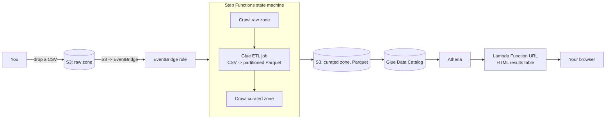

# Serverless ETL Pipeline on AWS

Drop a CSV into an S3 bucket and it's automatically crawled, transformed to partitioned Parquet, re-cataloged, and queryable — no manual steps. Orchestrated with Step Functions, transformed with AWS Glue, queried with Athena, and browsable through a plain-HTML GUI (a Lambda Function URL), no console or CLI needed to see results.

## Architecture



| Stage | Service | What it does |
|---|---|---|
| Ingest | S3 (raw zone) + EventBridge | New object triggers the pipeline via a native S3 → EventBridge notification |
| Orchestrate | Step Functions | Crawl → transform → crawl, with automatic rollback-free retries via polling loops and a native `.sync` wait on the Glue job |
| Catalog | Glue Crawlers + Data Catalog | Infers schema from raw CSVs and curated Parquet, keeps the catalog current |
| Transform | Glue ETL job (PySpark) | Casts types, partitions by year/month, writes Parquet |
| Query | Athena | SQL over the curated Parquet, billed per query (no idle cost) |
| View | Lambda Function URL | Runs one fixed query and renders an HTML table — click, don't type |

## One-time setup (requires local AWS CLI + Terraform)

Like the [ECS CI/CD pipeline](https://github.com/aws-pipelines/aws-ecs-cicd-pipeline) in this series, this is the "codified IaC" showcase, meant to be applied with Terraform rather than clicked through the console.

```bash
cd terraform
terraform init
terraform apply
```

That's it — no required variables. Terraform also seeds [`data/orders_sample.csv`](data/orders_sample.csv) into the raw bucket so there's something to process immediately.

After `apply` finishes:

1. Check the `state_machine_console_url` output and open it to watch the first pipeline run (crawl → transform → crawl takes roughly 3-5 minutes, mostly Glue cold-start time).
2. If no execution started automatically (EventBridge rules only catch events created *after* the rule exists, so the very first upload can race it) — open the `raw_bucket_name` output bucket in the S3 console and re-upload `orders_sample.csv` (or any CSV with the same columns) under `raw/orders/` to trigger it manually.
3. Once the run succeeds, open the `query_gui_url` output in a browser to see the curated data as an HTML table.

## Processing your own data

Upload any CSV with a header row to `s3://<raw_bucket_name>/raw/orders/` through the S3 console. To use a different schema entirely, edit [`glue_jobs/transform.py`](glue_jobs/transform.py) (it's a plain PySpark script) and adjust `query_app/handler.py`'s `QUERY` constant to match your new column/table names.

## Design choices worth calling out

- **No user input reaches SQL.** The query GUI runs one fixed, hardcoded Athena query — there's no injection surface, at the cost of not being a general-purpose query tool. That trade is deliberate for a public, unauthenticated endpoint.
- **Polling loops for crawlers, native `.sync` for the Glue job.** Step Functions has a built-in synchronous integration for `glue:startJobRun` (the state machine literally blocks until the job finishes), but not for `glue:startCrawler` — so the crawler steps use an explicit Wait → GetCrawler → Choice loop instead. Both patterns are visible side by side in [`statemachine/pipeline.asl.json`](statemachine/pipeline.asl.json).
- **EventBridge-native S3 notifications**, not a CloudTrail data-events trail — cheaper and simpler to set up, standard practice since AWS added native EventBridge support for S3 events.

## Cost

Unlike the ECS pipeline in this series, **nothing here bills by the hour** — everything is pay-per-use:

| Resource | Cost |
|---|---|
| Glue crawlers/ETL job | ~$0.44/DPU-hour, billed per-second with a 1-minute minimum — a demo run costs a few cents |
| Athena queries | $5/TB scanned, 10MB minimum per query — a demo query costs a fraction of a cent |
| Step Functions | First 4,000 state transitions/month free (permanent), then $0.025/1,000 — a full pipeline run uses ~12 transitions |
| Lambda (query GUI) | Covered by the permanent Always Free tier (1M requests/month) |
| S3 storage | Negligible for a sample dataset |

Running this pipeline occasionally to demo it costs cents, not dollars — but it's not literally $0.00 like the pure-Lambda project in this series, since Glue and Athena are metered per-use rather than free-tier-eligible.

## Cleanup

```bash
cd terraform
terraform destroy
```
